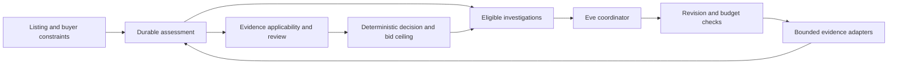

# Paddock

A personal project by [Raghav Maini](https://raghavmaini.com/), exploring how AI agents can support decisions as the evidence changes.

A damaged exotic can make sense for a buyer with the tools, time and skills to
repair it, while being an expensive mistake for someone paying shop rates.
Paddock makes those differences explicit: the repair scope, this buyer's costs,
the evidence behind the exit value, and what still needs to be established
before a bid can be justified.

The interesting part is what happens when the facts change. New damage can
invalidate an earlier repair quote. A higher auction bid can make another
investigation pointless. The assessment retains its history, rechecks evidence
applicability and withdraws support for a decision when its basis no longer holds.

I wrote about the engineering decisions behind it in **[Designing AI agents for decisions that keep changing](https://raghavmaini.com/writing/designing-ai-agents-for-decisions/)**.

## What is implemented

- **Enthusiast search.** Queries such as `e46 m3`, `996 turbo`, `2jz` and `c7`
  become reviewable constraints. Ambiguous shorthand produces separate readings;
  missing catalog facts remain unresolved.
- **A persistent assessment.** Buyer constraints, source observations, model
  claims, documentary reviews and decision revisions live in a durable record.
  Refreshing a conversation does not reset the research allowance.
- **Bounded investigation.** Eve coordinates eligible research actions. The
  application checks ownership, revisions, applicability and budget before a
  capability executes. Late results cannot revive a stopped assessment.
- **Deterministic economics.** Repair costs, bid ceilings and exit scenarios are
  computed in application code. A model cannot approve its own evidence, attest
  to a physical inspection, purchase a vehicle or place a bid.
- **Follow-through.** Durable dispatch, bounded watches and outcome recording
  provide a basis for measuring forecasts against later observations.

## How the agent fits



The coordinator sees a compact projection of the current record. It selects
work; the application determines whether that work is still allowed. Source
observations, extracted fields, model inferences and owner reviews remain
separate. Inspection and quote reviews bind to repair scope, so new damage
reopens the requirements that an earlier decision depended on.

The stack is TypeScript, Next.js/React, Eve and libSQL, with optional Postgres
for run persistence. See [agent assessments](docs/agent-assessments.md) for
execution, cancellation, context and spending boundaries, and [SPEC.md](SPEC.md)
for the testable invariants.

## Run the recorded demo without model spend

Requires **Node 24+** and **pnpm 10**.

```sh
pnpm install --frozen-lockfile
pnpm catalog:sample
cp .env.example .env.local
```

In `.env.local`, set `DATABASE_URL=file:data/eval.db`, set
`ASSESSMENTS_DATABASE_URL=file:/absolute/path/to/paddock/data/assessments.db`
using your checkout's actual path, and give `PADDOCK_AGENT_TOKEN` a fresh random secret of at least 24 characters
(`openssl rand -hex 32` generates one). Leave the provider keys empty and
`PADDOCK_AGENT_MODE=fixture`.

```sh
pnpm dev
```

Open `http://localhost:3000/assessments`, choose **Run recorded case**, then
choose **Continue research** on the saved assessment. Local Eve schedules do
not fire, so this second step delivers the saved research intent.
Next runs the Eve service alongside the app; the assessment persists in a local
libSQL file. The recorded demo and fixture coordinator make no model-provider
calls. Auction photographs, where displayed, are external third-party resources.

The legacy inspection and salvage analysis endpoints require provider credentials;
they are separate from this recorded assessment demo. Live coordination and live
evidence are explicit opt-ins documented in [agent assessments](docs/agent-assessments.md).

## Catalog and evidence

`pnpm catalog:sample` uses the committed, checksum-verified EPA sample.
`pnpm catalog:install` downloads the full public DOE/EPA configuration catalog.
Neither command calls a model. A richer catalog can be supplied explicitly:

```sh
pnpm ingest:user --csv /path/to/catalog.csv
pnpm catalog:check
```

EPA configurations are not exhaustive trim, option or parts-fitment records.
Unknown engine layout, exact engine codes and unsupported generation boundaries
stay visible. Observed model years do not establish production boundaries.
See [catalog coverage](docs/catalog.md) and [sample provenance](data/README.md).

Historical auction examples preserve source links and collection dates. They are
recorded examples, not current inventory or independently verified inspections.
The repository includes no auction image files. External photographs and source
websites retain their own rights and terms; see [third-party notices](THIRD_PARTY_NOTICES.md).

## Evals and their limits

| Command                | What it checks                                                       | Model-provider spend |
| ---------------------- | -------------------------------------------------------------------- | -------------------- |
| `pnpm test`            | Domain rules, persistence, authority and failure handling            | None                 |
| `pnpm eval`            | Resolver, inspector and salvage fixture regressions                  | None                 |
| `pnpm eval:decisions`  | Independent synthetic buyer/decision cases                           | None                 |
| `pnpm eval:agent`      | Actual Eve runtime, tools, persisted state, restart and cancellation | None                 |
| `pnpm eval:agent:live` | A real coordinator choosing actions against local test evidence      | Explicit paid opt-in |

Fixture success establishes orchestration and policy behavior. It does **not**
show that a model chooses better investigations than a simple policy, or that
Paddock predicts profitable rebuilds. The fixture coordinator follows the offered
action order. Repair uncertainty is currently a heuristic for research priority;
context summaries are capped, and scope fingerprints can require conservative
re-review. Real calibration needs outcomes recorded after the forecasts being
judged. Those limitations are part of the design, not completed research claims.

Inspect the [resolver/inspection results](evals/results.md),
[decision results](evals/agent/decision-results.md) and
[actual-runtime results](evals/agent/results.md). For the full local production
build, run `pnpm build:all`.

## Development and publication

Start with [AGENTS.md](AGENTS.md), [SPEC.md](SPEC.md) and the
[documentation index](docs/README.md). Add capabilities through typed adapters,
domain enforcement and behavioral evaluations. Hosted deployments require
explicit authentication and storage configuration; see [deployment](docs/deployment.md).

This public repository starts from a reviewed source snapshot. It does not
include the private development history, the original vehicle dataset or local
runtime databases. [Public release](docs/public-release.md) documents the export
boundary and how to prepare later snapshots without importing private history.

## Rights

Copyright © 2026 Raghav Maini. The original project code is publicly readable
with rights reserved; **no open-source license is granted**. See [COPYRIGHT](COPYRIGHT).
DOE/EPA data and third-party dependencies retain their own terms and are not
covered by that reservation of rights.
